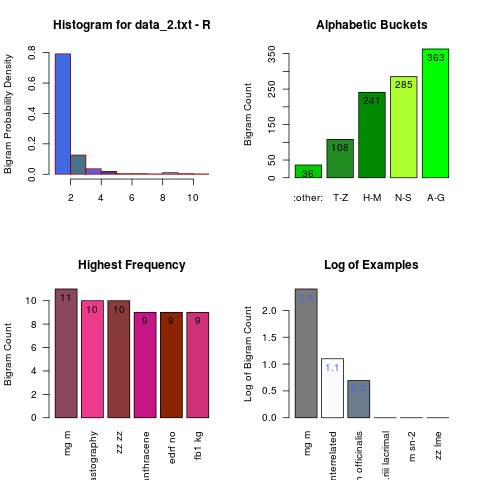
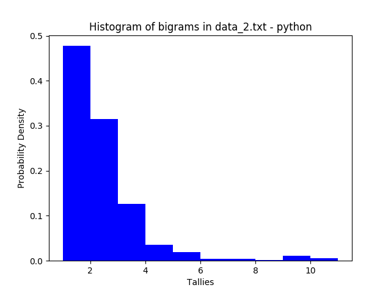
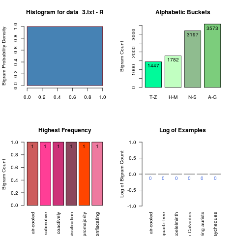

```{r setup, include=FALSE}
knitr::opts_chunk$set(echo = TRUE)
```

### Problem Statement
Create an application that can take as input any text file and output a histogram of the bigrams in the text.
A bigram is any two adjacent words in the text. A histogram is a kind of graphical representation of numerical data.
A well-formed submission will be executable and accompanied by tests. You may do this in any language and use any framework or data structures to read files, build the output, and run tests. The submission should be your own work. Great candidates go above and beyond the problem statement and think about edge cases and failure.

### Approach
To catch discrepancies in results and thus reduce error, I have written an R function (bigram.R) and a python function (bigram.py). Both functions process three test files as shown below. I have chosen R (app.R) for running a displayable application.

### Executability
An R shiny application is available at [https://brantmerrell.shinyapps.io/bigrams/](https://brantmerrell.shinyapps.io/bigrams/), which allows users to manually upload one txt file at a time and view the resulting histogram of bigrams. The shiny application can also be run from the R console:  
```{r, eval=F}
library(shiny)
runApp()
```
Additionally, the R and python functions create histograms in a *gallery* directory when called from the bash command line or from their respective terminals:
```{r, engine="bash", eval=F}
# Bash sommand line
Rscript bigram.R "<file_name.txt>"
python bigram.py "<file_name.txt>"
```
```{r, eval=F}
# R terminal
source("bigram.R")
bigram("<file_name.txt>")
```
```{r, engine="python", eval=F}
# Python terminal
from bigram import bigram # import function in python
bigram("<file.name.txt>") # generate file.png
```

### Issues to Fix
**Histogram issues**  
*Review of the histograms generated (my thanks to MD Weight) calls attention to a few issues with the histograms.*  
 *   __A key is required for an understandable plot__.  
 *  +   __The difficulty__: there are limits to what a histogram can convey when it is supposed to be able to model any text file. For example, when there are ten bigrams in the file, the histogram can assign each one its own place on the X axis, but when there are a thousand, they need to be bucketed somehow.  
 *  +   __The solution__: Bucket bigrams according to the percentage with which they occur or their place in the alphabet, and provide a descriptive key for the buckets.  
 * __Raw counts create polarized plot data__. Plotting by the log of the counts allows more to be inferred about the shape of the dataset.

### Test Files
**data_1**  
A text file with relatively few unique bigrams.
```{r, eval=F}
# create vector of five bigrams
words <- c("and; AND", "or, Or", "if... iF", "1he, 1he", "wh'en, wh'en", "why, why", 
           "where, wheRe", "how - how?", "who? Who!", "what, what")

# expand five unique bigrams into 1000
words <- sample(words, 1000, replace = T)

# create data_1 document
writeLines(words, "data_1.txt")
```

**data_2**  
A list of 1000 words with 100 unique values, sorted by character length but not alphabetized.
```{r, eval=F}
# Obtain a sample of vocabulary words
vocab <- readLines("https://archive.ics.uci.edu/ml/machine-learning-databases/bag-of-words/vocab.pubmed.txt")

# Select 100 words intersparced evenly across the vector
vocab <- vocab[seq(1,length(vocab), length.out = 100)]

# Duplicate the 100 words into a vector of 10000 words
words <- sample(vocab, 1000, replace = T)

# Sort words by character count
words <- words[order(nchar(words))]

# Collapse words into a single string
words <- paste(words, collapse = " ")

# create data_2
writeLines(words, "data_2.txt")
```

**data_3**  
English words.
```{r, eval=F}
# Download a sample of unique vocabulary words
vocab <- readLines("https://github.com/dwyl/english-words/blob/master/words.txt?raw=true")
# randomly select 10,000
vocab <- sample(vocab, 10000)
# create data_3
writeLines(paste(vocab, collapse = " "), "data_3.txt")
```

### Test results
The following bash code tests each of the two scripts with each of the three datasets:
```{r, engine="bash", eval=T}
# run bigram.R on data_1
Rscript bigram.R "data_1.txt"

# run bigram.py on data_1
python bigram.py "data_1.txt"

# run bigram.R on data_2
Rscript bigram.R "data_2.txt"

# run bigram.py on data_2
python bigram.py "data_2.txt"

# run bigram.R on data_3
Rscript bigram.R "data_3.txt"

# run bigram.py on data_2
python bigram.py "data_3.txt"
```


**data_1**  
,  

**data_2**  
,  

**data_3**  
,  
