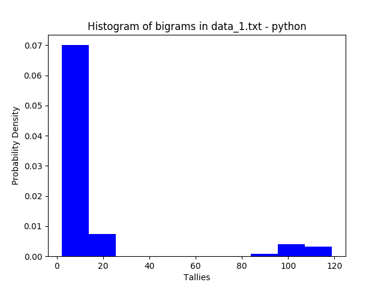
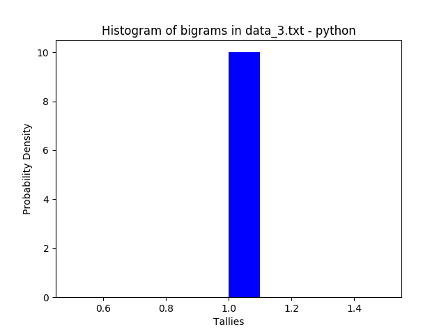

```{r setup, include=FALSE}
knitr::opts_chunk$set(echo = TRUE)
```

## Problem Statement
Create an application that can take as input any text file and output a histogram of the bigrams in the text.
A bigram is any two adjacent words in the text. A histogram is a kind of graphical representation of numerical data.
A well-formed submission will be executable and accompanied by tests. You may do this in any language and use any framework or data structures to read files, build the output, and run tests. The submission should be your own work. Great candidates go above and beyond the problem statement and think about edge cases and failure.

## Approach
To catch discrepancies in results and thus reduce error, I have written an R function (bigram.R) and a python function (bigram.py). Both functions process three test files as shown below. I have chosen Shiny (app.R) for running a displayable application.

## Executability
An R shiny application is available at [https://brantmerrell.shinyapps.io/bigrams/](https://brantmerrell.shinyapps.io/bigrams/), which allows users to manually upload one txt file at a time and view the resulting histogram of bigrams. The shiny application can also be run from the R console:  
```{r, eval=F}
library(shiny)
runApp()
```
Additionally, the R and python functions create histograms in a *gallery* directory when called from the bash command line or from their respective terminals:
```{r, engine="bash", eval=F}
# Bash command line
Rscript bigram.R "<file_name.txt>"
python bigram.py "<file_name.txt>"
```
```{r, eval=F}
# R terminal
source("bigram.R")
bigram("<file_name.txt>")
```
```{r, engine="python", eval=F}
# Python terminal
from bigram import bigram # import function in python
bigram("<file.name.txt>") # generate file.png
```
## Testing
### Data 1  
In R, built text file with a high frequency of few words:
```{r, eval=F}
# create vector repeated words
words <- c("and; AND", "or, Or", "if... iF", "1he, 1he", "wh'en, wh'en", "why, why", 
           "where, wheRe", "how - how?", "who? Who!", "what, what")

# expand into a lot more words
words <- sample(words, 1000, replace = T)

# create data_1 document
writeLines(paste(words, collapse = " "), "data_1.txt")
```

From bash command line, generate images and store in gallery:  
```{r, engine="bash",eval=T}
# run bigram.R on data_1
Rscript bigram.R "data_1.txt"

# run bigram.py on data_1
python bigram.py "data_1.txt"
```

Display images from gallery:  
,  

### Data 2
In R, grab some words from the internet, duplicate them randomly, and sort by character length but do not alphabetize:
```{r, eval=F}
# Obtain a sample of vocabulary words
vocab <- readLines("https://archive.ics.uci.edu/ml/machine-learning-databases/bag-of-words/vocab.pubmed.txt")

# Select 100 words intersparced evenly across the vector
vocab <- vocab[seq(1,length(vocab), length.out = 100)]

# Duplicate the 100 words into a vector of 10000 words
words <- sample(vocab, 1000, replace = T)

# Sort words by character count
words <- words[order(nchar(words))]

# Collapse words into a single string
words <- paste(words, collapse = " ")

# create data_2
writeLines(words, "data_2.txt")
```
From bash command line, generate images and store in gallery:  
```{r, engine="bash",eval=T}
# run bigram.R on data_2
Rscript bigram.R "data_2.txt"

# run bigram.py on data_2
python bigram.py "data_2.txt"
```
Display images from gallery:  
,  

### Data 3  
In R, grab 10000 unique words.
```{r, eval=F}
# Download a sample of unique vocabulary words
vocab <- readLines("https://github.com/dwyl/english-words/blob/master/words.txt?raw=true")
# randomly select 10,000
vocab <- sample(vocab, 10000)
# create data_3
writeLines(paste(vocab, collapse = " "), "data_3.txt")
```
From bash command line, generate images and store in gallery:  
```{r, engine="bash", eval=T}
# run bigram.R on data_3
Rscript bigram.R "data_3.txt"

# run bigram.py on data_3
python bigram.py "data_3.txt"
```
Display images from gallery:  
,  


## Issues, Options, Discussion
 * __Logs versus raw counts__. Raw counts are more straightforward, logs are (potentially) more informative.    
 * __Probability density versus frequency__.  
 * __Bucket Categories & Methods__ - quantiles, character counts, pair similarities, alphabet, probability...  
 * __Presentation versus Exploration__. Histograms use two dimensions to model a single variable. This makes them valuable for inferring from the shape of the data an analytic method with which to proceed, but frustrating to those attempting to understand actual values of the dataset. In data_3, for example, the single rectangle shown by the histogram would appear to be a mistake at first glance, until compared with the three barplots which explain that only one of each bigram exists in the dataset.  
 * __Visualization options__.  Currently if output=="png", a png file is generated, otherwise an image is directly returned. These are the bare minimum of options required for compatibility with shiny, bash, the R console, the python console, and this readme. Other options (or multiple options at once) are natural next steps depending on the needs of the project.  
 * __What is a good Python analogue of Shiny?__  
    +   Use [pyxley](https://github.com/stitchfix/pyxley) with d3.js or another js library  
    +   [spyre](https://github.com/adamhajari/spyre)  
    +   [Dash](https://medium.com/@plotlygraphs/introducing-dash-5ecf7191b503)  
    +   [Is there one?](https://twitter.com/wesmckinn/status/608876142557208577)  

